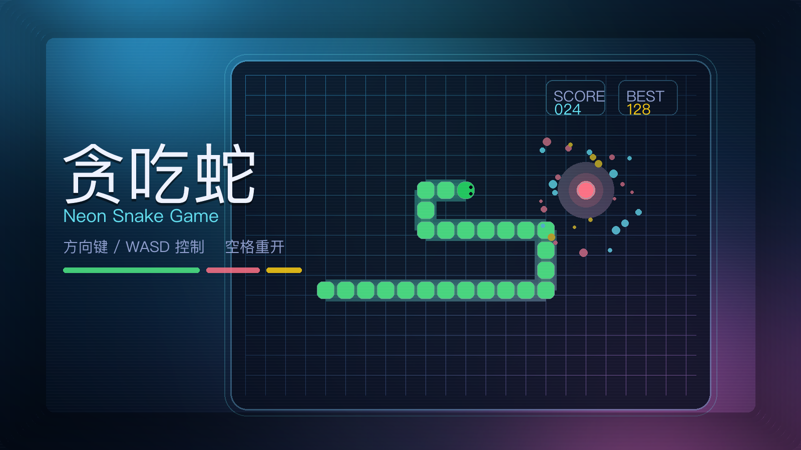

# 贪吃蛇：街机新版

一款使用原生 HTML、CSS 和 JavaScript 制作的网页贪吃蛇小游戏。控制小蛇在网格中收集物品、提升分数和关卡，并避开墙壁、障碍物与自己的身体。



## 功能亮点

- 20 × 20 网格地图与经典贪吃蛇玩法
- 多种可收集物：普通食物、金币、护盾、毒物、加速与缓速
- 分数升级、速度变化和自动生成障碍物
- 护盾可抵消一次撞墙、撞障碍物或撞到自己
- 本地最高分保存、暂停/继续与结束后快速重开
- 键盘操作和移动端虚拟方向键
- 音效、粒子、轨迹与面板反馈效果

## 开始游戏

无需安装依赖或构建。在浏览器中直接打开演示页面：

```bash
open demo/index.html
```

也可以在文件管理器中双击 `demo/index.html`。

## 操作说明

| 按键 | 操作 |
| --- | --- |
| `↑` / `W` | 向上移动 |
| `↓` / `S` | 向下移动 |
| `←` / `A` | 向左移动 |
| `→` / `D` | 向右移动 |
| `P` / `空格` | 暂停或继续 |
| `空格` | 游戏结束后重新开始 |

移动设备可使用页面底部的虚拟方向键。

## 收集物

| 类型 | 效果 |
| --- | --- |
| 食物 | 增加 1 分并让蛇身增长 |
| 金币 | 增加 5 分 |
| 护盾 | 增加 1 分并获得一层护盾 |
| 毒物 | 扣除 2 分并缩短蛇身 |
| 加速 | 增加 2 分、增长蛇身并提高速度 |
| 缓速 | 增加 1 分、增长蛇身并降低速度 |

## 测试

项目使用 Node.js 的内置能力执行回归测试：

```bash
node demo/test/script.test.js
```

测试覆盖碰撞判定、物品效果、升级障碍物、暂停状态、本地存储容错和键盘默认行为拦截。

## 项目结构

```text
.
├── demo/
│   ├── index.html       # 游戏页面
│   ├── style.css        # 页面与游戏视觉样式
│   ├── script.js        # 游戏逻辑、输入与音效
│   └── test/
│       └── script.test.js
├── game-cover.png       # 游戏封面
└── README.md
```

更多演示实现细节请参阅 [demo/README.md](./demo/README.md)。
